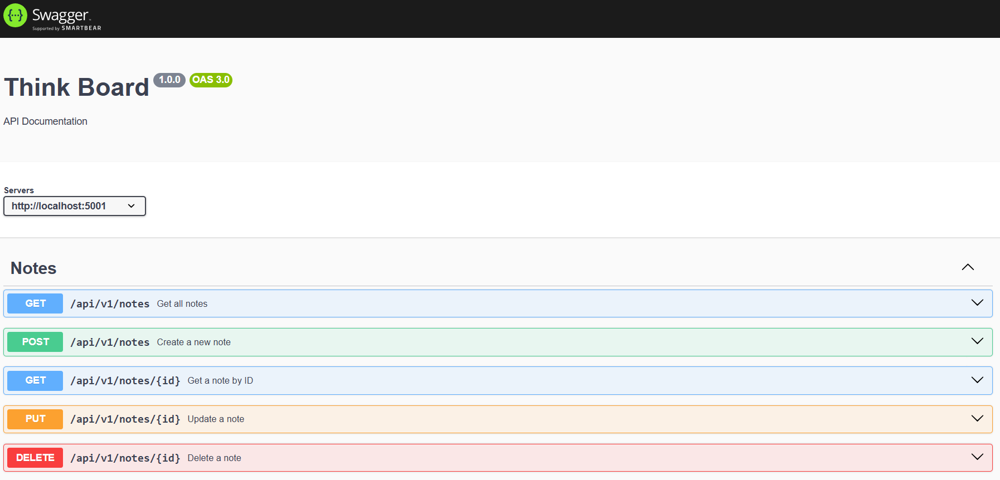

<h1 align="center">Think Board</h1>

This is a full-stack Notes app built with the MERN stack (MongoDB, Express, React, Node.js). It supports full CRUD operations, implements rate limiting using Upstash Redis, and is deployed on Render.

## Features

- Full-stack implementation using MongoDB, Express, React, and Node.js (MERN)
- Create, update, and delete notes with title and description
- RESTful API with proper error handling and testing
- Rate limiting integrated via Upstash Redis for enhanced security
- Fully responsive UI for all screen sizes
- Deployed live on Render — [ThinkBoard](https://think-board-db7v.onrender.com/)


## Tech Stack

| Category     | Technologies                                                                 |
|--------------|------------------------------------------------------------------------------|
| **Frontend** | React.js, HTML5, Tailwind CSS, Axios (for API requests)                              |
| **Backend**  | Node.js, Express.js, MongoDB Atlas, Mongoose, Upstash Redis (Rate Limiting) |
| **Others**   | RESTful API, Swagger, Render (Deployment), Git & GitHub (Version Control)            |


## Getting Started

Follow these steps to set up and run the project locally.

### 1) Prerequisites

Make sure you have the following installed on your system:

- [Node.js](https://nodejs.org/en/download/) (v16 or later)
- [npm](https://www.npmjs.com/)
- [MongoDB Atlas Account](https://www.mongodb.com/cloud/atlas)
- [Upstash Redis Account](https://upstash.com/)
- [Swagger](https://swagger.io/tools/swagger-ui/) 
- A modern web browser

### 2) Installation Guide

Clone the repository:

```bash
git clone https://github.com/msaakaash/think-board.git
cd think-board
```

#### 🔧 Backend Setup

```bash
cd backend/src
npm install
npm run dev
```

This runs the backend server using `nodemon server.js`.

#### Frontend Setup

```bash
cd frontend
npm install
npm run dev
```

This runs the frontend React app using `npm run dev`.

### 3) .env Setup

Create a `.env` file in the `/backend` directory with the following content:

```env
MONGO_URI=<your_mongo_uri>

UPSTASH_REDIS_REST_URL=<your_redis_rest_url>
UPSTASH_REDIS_REST_TOKEN=<your_redis_rest_token>

NODE_ENV=development
```

Replace placeholder values with your actual credentials.


## API Documentation

The API is documented using **Swagger** for ease of use and clarity.

> You can access the Swagger UI at:  
> `http://localhost:5001/api-docs` _(or your configured path)_

### Swagger UI Screenshot



## Contributing
Contributions are welcome! Please see [CONTRIBUTING.md](docs/CONTRIBUTING.md) for guidelines.

## Code of Conduct
Please read our [Code of Conduct](docs/CODE_OF_CONDUCT.md) before contributing to this project.

## Security
If you discover a vulnerability, please refer to our [Security Policy](docs/SECURITY.md) for instructions on how to report it responsibly.

## License  
This project is licensed under the [MIT LICENSE](LICENSE).


## Author

[**Aakaash M S**](https://github.com/msaakaash)
